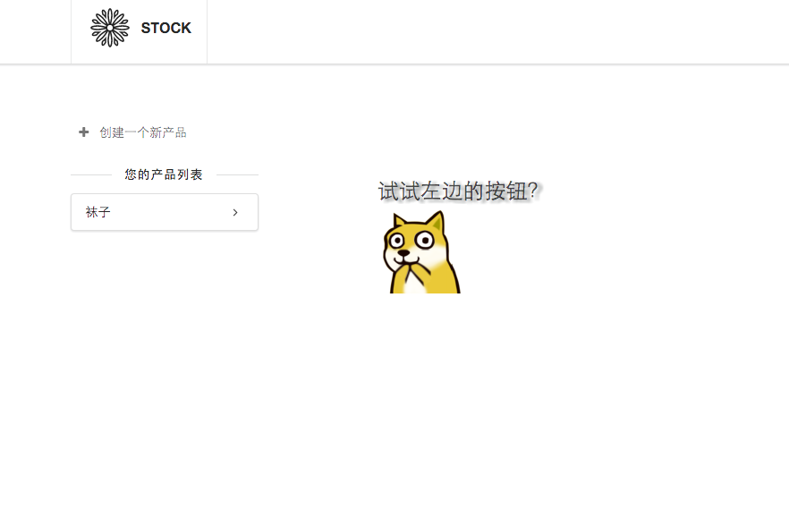

# stock-application
一个轻量的库存管理软件，数据都存在localstorage里

[http://billyct.github.io/stock-application](http://billyct.github.io/stock-application/)




## 开发

```bash
$ git clone https://github.com/billyct/stock-application.git
$ cd stock-application
$ npm install
$ gulp
```